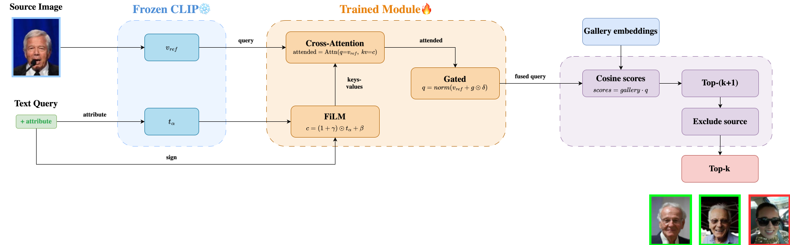
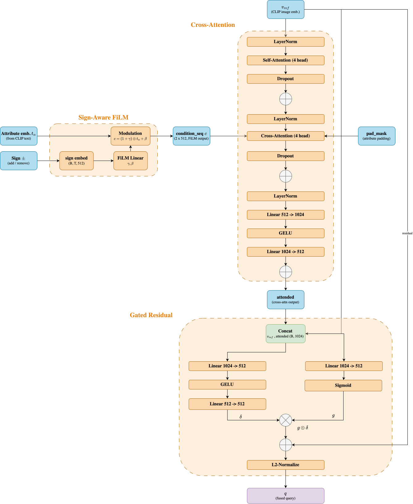
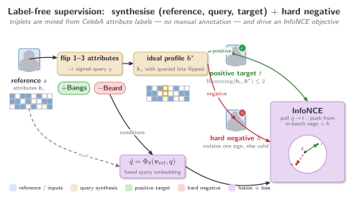

# Compositional Image Retrieval

The project studies **compositional image retrieval** on CelebA: given a *source image* and a signed textual edit (`+attr` / `−attr`), the objective is to retrieve gallery images that preserve the source while applying the requested attribute changes.
This work adopts the CLIP-based compositional retrieval setting introduced in **CLAY** [(Lim et al., 2026)](https://arxiv.org/abs/2604.11539), utilizing a **frozen CLIP encoder** [(Radford et al., 2021)](https://arxiv.org/abs/2103.00020).

## Contributions

In this project, we investigate how to overcome the **static multi-condition fusion** of **CLAY** [(Lim et al., 2026)](https://arxiv.org/abs/2604.11539). CLAY enables efficient, training-free retrieval by separating text conditioning from visual features. It achieves this by projecting frozen visual features onto a textual subspace constructed for each condition. Multiple conditions are then merged into a single static subspace that weights every condition uniformly. Crucially, CLAY only supports positive, additive conditions; it lacks a mechanism for signed (additive or subtractive) attributes and cannot resolve multiple or competing conditions for a single query.

We propose the following training-free methods for compositional image retrieval:

- **Baseline**: a zero-shot, training-free starting point using raw embedding-space arithmetic on the frozen CLIP ViT-B/32 encoder [(Radford et al., 2021)](https://arxiv.org/abs/2103.00020).
- **Source-Attribute Matching**: upgrades the *fusion mechanism*, replacing embedding arithmetic with explicit per-attribute comparison against the source in a calibrated similarity space.
- **Prompt Ensembling**: upgrades only the *text bank*, leaving the scorer untouched, with an article-free adaptation of CLIP's ImageNet prompt ensemble.

Before settling on a trained model, we also built and discarded two *learned* alternatives: prompt optimization via **CoOp** [(Zhou et al., 2022)](https://arxiv.org/abs/2109.01134) and concept editing via **Sparse Autoencoders** [(Gao et al., 2024)](https://arxiv.org/abs/2406.04093) - neither of which showed improvement over the multi-condition fusion problem.

Our main contribution, **Cross-Attention Fusion**, addresses this by dynamically modeling the interaction between the reference image and its sequence of signed textual conditions via cross-attention [(Vaswani et al., 2017)](https://arxiv.org/abs/1706.03762). Rather than statically combining condition embeddings prior to retrieval, this approach computes image-conditioned weights for each attribute, moving past the uniform, static weighting used in CLAY.

---

## Data Loading and Exploration

The dataset is **CelebA** [(Liu et al., 2015)](https://arxiv.org/abs/1411.7766), a large-scale face dataset of over 200,000 celebrity images annotated with **40 binary facial attributes**. We use a subset of **19,962 samples**, each consisting of:
- a **face image** of size 178 × 218 pixels,
- a corresponding **40-dimensional attribute vector** describing traits such as *smiling*, *eyeglasses*, *male*, *young*.

---

## Offline Feature Extraction

We use **CLIP** (ViT-B/32) as a **frozen** feature extractor, encoding every image into a fixed 512-d vector [(Radford et al., 2021)](https://arxiv.org/abs/2103.00020). Since these embeddings never change, we precompute them offline once.

All embeddings are L2-normalized to unit vectors at extraction time. Similarity between a query $\mathbf{q}$ and a gallery vector $\mathbf{g}$ is then a plain dot product:

$$\text{similarity}(\mathbf{q}, \mathbf{g}) = \mathbf{q} \cdot \mathbf{g},$$

Retrieval over the whole gallery is therefore a single matrix multiplication rather than a pairwise loop.

---

## Embedding Analysis: Class-Image Similarity

Before constructing the retrieval model, we first assess how well CLIP distinguishes the 40 CelebA attributes. For each attribute, we select a "pure" image: one that has the attribute active while minimizing co-occurring traits, breaking ties at random. We then compute a \(40 \times 40\) cosine similarity matrix between the image embeddings and the 40 attribute text prompts.

The diagonal is not dominant. Instead, the matrix is driven by row and column biases, with some prompts and images scoring consistently highly across unrelated pairs. Moreover, all cosine similarities fall within a narrow range (approximately \(0.13\)–\(0.27\)), providing little discriminative signal. Raw CLIP cosine similarity therefore captures broad facial semantics rather than the fine-grained attribute information required for reliable retrieval.

---

## Metrics

We evaluate every method with two standard top-$K$ retrieval metrics, computed per *(query, source image)* pair at $K \in \{1, 5, 10\}$. Let $\mathcal{R}_K$ be the ordered set of top-$K$ retrieved gallery images (the source image itself excluded) and $\mathcal{G}$ the ground-truth set of valid retrievals for that query.

- **Recall@K (hit rate).** Whether *at least one* valid image appears in the top $K$:
$$\text{Recall@}K = \mathbb{1}\big[\,|\mathcal{R}_K \cap \mathcal{G}| > 0\,\big] \in \{0, 1\}.$$

- **Precision@K.** The fraction of the top $K$ retrievals that are valid:
$$\text{Precision@}K = \frac{|\mathcal{R}_K \cap \mathcal{G}|}{K}.$$

Both metrics are first averaged over the source images of each query (reported with a 95% confidence interval), and the **mean Recall@10** across all *(query, source)* pairs is the single headline scalar we use to compare methods and tune hyperparameters.

---

## Evaluation Protocol

To assess the performance of our retrieval system, we utilize a standardized benchmark of queries stored in a JSON file. Each entry in the dataset follows this structure:

* **`query`**: A string representing the textual modification (e.g., `"+glasses, -smiling"`).
* **`ground_truth`**: A dictionary mapping source image indices to lists of valid target image indices.

### Example Structure

```json
{
    "query": "+glasses, -smiling",
    "ground_truth": {
        "0": [1, 2, 3],
        "4": [5, 6, 7]
    }
}

```

In this example, image `0` is the source (e.g., a smiling person without glasses). The system must retrieve images `1`, `2`, or `3`, which represent the modified target state (not smiling, with glasses).

### Ground Truth Validity Criteria

An image is considered a valid retrieval for a given source and query if it meets two conditions:

1. **Strict Attribute Matching:** It must perfectly satisfy the explicit edits requested in the query (e.g., it *must* have glasses and *must not* be smiling).
2. **Visual Consistency:** To ensure the target image remains visually close to the source, we enforce a strict threshold allowing a maximum of **two incidental attribute changes** outside of the requested query.

---

## Baseline Method

To establish a baseline, we evaluate a **zero-shot, training-free approach** that relies on simple latent space arithmetic using pre-computed CLIP embeddings.

Starting from the source image embedding, we add the embeddings of the requested attributes (`+`) and subtract the embeddings of the removed attributes (`−`). The resulting vector is then used to find the nearest neighbors in the dataset via cosine similarity.

Let $\mathbf{v}_s$ be the raw CLIP visual embedding of the source image, and $\mathbf{t}_j$ be the raw CLIP text embedding for attribute $j$. Given the sets of attributes to add ($q^+$) and remove ($q^-$), the unnormalized composite query vector $\mathbf{f}$ is:

$$\mathbf{f} = \mathbf{v}_s + \sum_{j \in q^+} \mathbf{t}_j - \sum_{j \in q^-} \mathbf{t}_j$$

### Scorer

To rank candidate images from the gallery, we normalize the composite query vector and compute its cosine similarity (inner product) with each unit-normalized gallery embedding $\hat{\mathbf{e}}_x$:

$$\text{score}(x) = \hat{\mathbf{e}}_x^{\top} \left( \frac{\mathbf{f}}{\|\mathbf{f}\|_2} \right)$$

## Source-Attribute Matching (Training-Free)

The baseline approach introduces two critical structural problems:

1. **Source Leakage:** The raw image embedding implicitly contains every visual attribute of the original person, including those the query explicitly requests to change. As a result, the system is heavily biased toward retrieving exact look-alikes of the source image rather than successfully applying the modifications.
2. **Embedding-Space Negation:** Subtracting an attribute embedding does not project into a region that represents the true linguistic complement of that concept in CLIP space.

To overcome these limitations, **Source-Attribute Matching (SAM)** utilizes the same core components (text and image cosine similarities) but fundamentally recasts the composition inside a **per-attribute similarity space**:

* **Per-Attribute Logits:** Every gallery image is compared against a text bank of all attributes. This creates a matrix where each entry represents the direct cosine similarity between a specific image and a specific trait.
* **Statistical Calibration (Z-Scoring):** To prevent dominant traits from overpowering the representation, we **z-score normalize** each attribute column independently. This centers each trait's distribution around a mean of 0 and a standard deviation of 1, placing all concepts on a comparable scale.
* **Explicit Decomposed Scoring:** The source image's row in the calibrated matrix serves as its semantic profile. Candidates are then evaluated using a scoring objective that balances three goals: satisfying the explicit query, preserving unmentioned background traits, and maintaining global visual identity.

By shifting operations to this calibrated similarity space, negation is handled by simply inverting a normalized score rather than subtracting vectors in latent space, resolving both baseline limitations.

### Scorer

Given a source image $s$ and a signed query $q$, the retrieval score for any candidate gallery image $x$ is defined by a multi-part objective that balances query compliance, background preservation, and global visual identity:

$$\text{score}(x) = \underbrace{w_q \sum_{j \in q} s_j Z_{xj}}_{\text{Queried Constraints}} \;-\; \underbrace{w_r \sum_{j \notin q} \big(Z_{xj} - Z_{sj}\big)^2}_{\text{Attribute Proximity}} \;+\; \underbrace{w_v \hat{\mathbf{e}}_x^{\top}\hat{\mathbf{e}}_s}_{\text{Visual Similarity}}$$

The operational mechanics of these three components are defined as follows:

* **Queried Constraints ($w_q$):** This drives the requested edits. It rewards candidate images that match the new query; either by looking for high positive scores when adding a trait, or high negative scores when removing one. Because we are using calibrated trait scores, removing a feature is as simple as flipping a mathematical sign.
* **Attribute Proximity ($w_r$):** This acts as a protective shield for the rest of the person's face. It penalizes any changes to the background traits that the query didn't mention, ensuring that unedited features (like hair color, age, or expression) stay as close to the original source image as possible.
* **Visual Similarity ($w_v$):** This preserves the overall look and feel of the original image using raw CLIP embeddings. It captures fine-grained details that text descriptions miss entirely.

---

## Prompt Ensembling (Training-free)

While Source-Attribute Matching improves the fusion mechanism, a single text prompt per attribute remains a noisy estimate of a concept. **Prompt Ensembling** addresses this by upgrading the text bank.

Instead of relying on a single word, each trait is defined by combining a bank of descriptive phrases with dozens of prompt templates. We average these combinations to create two distinct, well-rounded CLIP profiles for every trait: a **positive profile** capturing its presence, and a **negative profile** capturing its explicit absence.
The benefits of this approach are twofold:

* **Noise Cancellation:** Averaging across dozens of prompt templates smooths out the linguistic quirks and inherent noise of individual prompts, establishing a stable baseline.
* **True Semantic Negation:** Rather than relying on simple arithmetic inversion, this approach uses a dedicated linguistic negative embedding.

### Scorer

To evaluate this method, only the embedding bank is modified, which it's passed directly to the Source-Attribute Matching framework.

#### CLIP ImageNet prompt templates

The per-attribute banks are ensembled over [CLIP's official ImageNet prompt templates](https://github.com/openai/CLIP/blob/main/notebooks/Prompt_Engineering_for_ImageNet.ipynb) (the canonical 80-template zero-shot set), plus a few portrait-specific templates for CelebA faces.


---

## Other experiments

Prior to adopting cross-attention, two alternative trained-based approaches were evaluated:

**CoOp (Context Optimization, [Zhou et al. 2022](https://arxiv.org/abs/2109.01134)):** Instead of utilizing handcrafted prompt prefixes, we employ CoOp to learn a set of $M=16$ continuous context vectors within CLIP’s word-embedding space, which are shared across all attributes. Once trained, this learned positive/negative text bank integrates directly into the same profile-matching scorer, utilizing identical weights.

While this optimization showed marginal improvements over prompt ensembling, it was ultimately excluded because the primary bottleneck resides in the fusion mechanism rather than prompt enrichment. Consequently, we chose to dedicate our investigation entirely to advancing architectural fusion strategies rather than tuning representation inputs.

**TopK-SAE Concept Editing ([Gao et al. 2024](https://arxiv.org/abs/2406.04093)):** This approach explores a representation-level modification aimed at extending CLIP while strictly preserving its zero-shot capabilities. To achieve this, a **TopK sparse autoencoder** is trained in an unsupervised manner to reconstruct cached CLIP image embeddings using an overcomplete dictionary of $H=4096$ unit-norm atoms, each isolating a specific directional feature.

At retrieval time, textual conditions are grounded zero-shot onto their highest-affinity atoms via mean-centered cosine similarity. The source image embedding is subsequently modified by shifting it exclusively along these selected atomic vectors, while the source identity is preserved via the unmodified residual embedding:

$$\mathbf{v}_{\text{target}} = \mathbf{v}_s + \sum_c \sigma_c \, \gamma_c \, \hat{\mathbf{u}}_c$$

Where $\mathbf{v}_{\text{target}}$ is the edited query embedding, $\mathbf{v}_s$ is the source embedding, $\hat{\mathbf{u}}_c$ is the unit-norm dictionary atom for condition $c$, $\sigma_c \in \{+1, -1\}$ is the condition sign, and $\gamma_c \ge 0$ is the retrieval-time edit magnitude.

Despite providing high-fidelity reconstructions, this approach failed to deliver decisive gains over the baseline. Query attributes rarely align cleanly with isolated monosemantic atoms. As a result, editing the grounded atoms injects unexpected semantic noise rather than precisely altering the intended attribute.

---

## Cross-Attention Fusion (Training-based)

Every method so far combines the visual reference and its textual conditions with a fixed, query-agnostic rule. These hard-coded combinations suffer from three specific architectural limitations:

* **Embedding-space negation:** Subtracting a text vector in CLIP space merely creates a geometric mirror point rather than a true semantic opposite.
* **Ungrounded edit directions:** A generic attribute vector remains identical across all inputs, failing to adapt to the specific visual context of the reference image.
* **Source leakage:** The reference embedding entangles every attribute of the person, including the one being edited, so a fixed combination is pulled toward look-alikes of the source and dilutes the requested change instead of separating what to keep from what to modify.

**Cross-Attention Fusion** instead *learns* the combination with a small module $\Phi_\theta$ trained on top of frozen CLIP: the reference image attends over its signed conditions to weigh each edit *per image* rather than by a fixed rule.

### Architecture

To achieve this adaptive combination, the source image is first processed at two distinct granularity simultaneously. CLIP processes the input into a regular grid of non-overlapping **spatial patch tokens** $V_{\text{raw}}$, which act as localized descriptors of specific regions like an eye or the hairline, enabling targeted, position-aware editing. Alongside these localized patches, the encoder extracts a specialized **CLS token**, a single global vector $\mathbf{v}_{\text{ref}}$ that pools and summarizes the entire face. In parallel, each textual condition (without the sign) is encoded into its own attribute vector $\mathbf{t}_a$.

The fusion process begins by passing each attribute vector $\mathbf{t}_a$ through **sign-aware FiLM conditioning** [(Perez et al., 2018)](https://arxiv.org/abs/1709.07871), a lightweight affine layer that rewrites each condition based on its positive or negative sign so that adding and removing a feature become distinct learned directions $\mathbf{c}_k$ rather than simple geometric mirror images.

Next, these conditions $\mathbf{c}_k$ undergo **patch grounding**: acting as queries, they read the projected patch tokens $V$ through the cross-attention of a Transformer-decoder layer [(Vaswani et al., 2017)](https://arxiv.org/abs/1706.03762), while self-attention lets the conditions co-adapt with one another. This anchors each requested edit directly onto the specific region of the reference face it should physically alter.

The core of the system relies on **stacked cross-attention**. The global image summary $\mathbf{v}_{\text{ref}}$ acts as the single query token, while the grounded, signed conditions $C$ serve as keys and values. In this setup, the image dynamically determines how strongly weight each requested edit based on its own identity. Stacking $L$ such decoder layers allows the image to iteratively read the conditions and update its representation, ultimately producing the attended vector $\mathbf{a}$.

Finally, **gated-residual fusion** [(Vo et al., 2019)](https://arxiv.org/abs/1812.07119) applies this attended vector $\mathbf{a}$ as a signed correction $\boldsymbol{\delta}$, gated per-dimension by $\mathbf{g}$, directly onto the global identity vector $\mathbf{v}_{\text{ref}}$. This mechanism preserves the source's original identity by default while allowing targeted features to be genuinely removed, ultimately producing a single unit-norm query $\mathbf{q}$ ready to rank the gallery by cosine similarity.



The diagram below expands the module layer by layer. Frozen CLIP encodes the reference into a unit-norm vector $\mathbf{v}_{\text{ref}}$ and exposes its visual-token sequence $V_{\text{raw}}=[\text{CLS};\,\text{patch}_1,\dots,\text{patch}_{49}]$. A query carries up to $T$ conditions, each a pair $(a_k,s_k)$ with $a_k$ a CelebA attribute index and $s_k\in\{+1,-1,0\}$ its sign ($0$ marks a padding slot); each $a_k$ selects its frozen bare-name text vector $\mathbf{t}_{a_k}$, so the conditions enter as a block that the four trained stages reshape, ground, read, and fuse onto $\mathbf{v}_{\text{ref}}$.

**Setup.** The module operates at CLIP's embedding width $D=512$, taking in the source's 50 visual tokens ($d_{\text{clip}}=768$, projected to $D$) and up to $T=3$ signed conditions; both decoder stacks below use $L=2$ layers, $h=4$ heads ($d_h=128$), and dropout $0.1$.

**1. Sign-aware FiLM conditioning** [(Perez et al., 2018)](https://arxiv.org/abs/1709.07871). *Problem:* a fixed sign flip ($-\mathbf{t}_j$) is not a faithful negation - it is just the mirror point of $\mathbf{t}_j$, not the linguistic complement of the concept. *Idea:* let the sign pick a learned, per-dimension affine transform of the attribute vector instead, so the network can discover how each coordinate should move under a `+` versus a `-`. Each sign selects one of two learned embeddings in a table $E_{\text{sign}}$, which a single affine layer turns into a per-dimension scale and shift:
$$\mathbf{z}_{s_k}=E_{\text{sign}}\big[\mathbb{1}[s_k<0]\big],\qquad (\boldsymbol{\gamma}_k,\boldsymbol{\beta}_k)=W_{\text{FiLM}}\,\mathbf{z}_{s_k}+\mathbf{b}_{\text{FiLM}},\qquad \mathbf{c}_k=(\mathbf{1}+\boldsymbol{\gamma}_k)\odot\mathbf{t}_{a_k}+\boldsymbol{\beta}_k.$$
$W_{\text{FiLM}}$ and $\mathbf{b}_{\text{FiLM}}$ are zero-initialised, so training starts from the raw CLIP semantics ($\mathbf{c}_k=\mathbf{t}_{a_k}$) and only gradually learns the bend. Because the modulation is multiplicative and attribute-specific rather than a plain additive offset, the $+$ and $-$ versions of one attribute can become unrelated directions, not mirror images. The modulated conditions form the memory $C=[\mathbf{c}_1,\dots,\mathbf{c}_T]$, with padding slots recorded in a boolean mask.

**2. Patch grounding.** *Problem:* even after FiLM, a condition vector is still the same regardless of which face it is applied to - "remove the glasses" has no notion of where on *this* person's face the glasses are. *Idea:* let the conditions read the source's own visual tokens before the image weighs them, so each edit can ground on the relevant region of this specific face rather than apply a generic, face-agnostic direction. The visual tokens are projected into the fusion space, $V=V_{\text{raw}}W_{\text{vis}}^{\top}$, plus a learned *type* embedding distinguishing the CLS token from the patches (CLIP's positional embeddings already encode patch location). The conditions then become the target of a standard pre-norm Transformer-decoder layer [(Vaswani et al., 2017)](https://arxiv.org/abs/1706.03762) reading from $V$: self-attention lets the conditions co-adapt with one another - tempering mutually exclusive or contradictory edits (e.g. `+Bald` and `+Bangs`) before the image ever reads them - cross-attention lets them ground spatially on the source, and a feed-forward sublayer adds capacity - so `+Eyeglasses` can read the eye patches of *this* face rather than a generic direction. The grounded $C$ replaces the raw conditions below.

**3. Stacked cross-attention** [(Vaswani et al., 2017)](https://arxiv.org/abs/1706.03762). *Problem:* a composed query like `+Eyeglasses & -Smiling` should not weight its conditions equally, nor by a global weight tuned once across the whole gallery (as `w_query` does in the training-free methods) - the right weighting depends on the particular face being edited. *Idea:* make the image the single query token and the grounded conditions the keys/values, so attention computes a content-based weighting that is recomputed per image. The reference token $\mathbf{v}_{\text{ref}}$ is refined by $L$ of the same standard pre-norm decoder layers, this time reading from the grounded conditions $C$ with padded slots masked out of the attention. With exactly one query token, the cross-attention sublayer collapses to a content-based weighted average of the unmasked conditions - weighted by the image itself, which is the mechanism this method is named for - and stacking $L$ layers lets the image read, update, and read again, yielding the attended vector $\mathbf{a}=\operatorname{Decoder}(\mathbf{v}_{\text{ref}};C)$.

**4. Gated-residual fusion.** *Problem:* the attention output above is still a softmax-weighted average of the conditions - it can emphasize or de-emphasize an edit, but a convex combination can never point *against* an attribute direction, so it cannot truly remove a feature [(Baldrati et al., 2022)](https://dblp.org/rec/conf/cvpr/BaldratiBUB22a.html); and an unconstrained fusion head risks drifting away from the reference entirely, eroding the source's identity. *Idea:* output a signed, gated correction added onto the reference, rather than a replacement for it, so identity is the default and only the necessary coordinates move, in either direction. The attended vector is concatenated with the reference, $\mathbf{u}=[\mathbf{v}_{\text{ref}};\mathbf{a}]$, and consumed by two heads: an edit head (a GELU MLP) producing a signed displacement $\boldsymbol{\delta}$, and a gate head (affine + sigmoid) producing a per-dimension gate $\mathbf{g}\in(0,1)^{D}$:
$$\boldsymbol{\delta}=W_2^{\delta}\,\operatorname{GELU}(W_1^{\delta}\mathbf{u}),\quad \mathbf{g}=\sigma(W^{g}\mathbf{u}),\quad \mathbf{q}=\Phi_\theta\big(\mathbf{v}_{\text{ref}},\{(a_k,s_k)\}\big)=\frac{\mathbf{v}_{\text{ref}}+\mathbf{g}\odot\boldsymbol{\delta}}{\lVert\mathbf{v}_{\text{ref}}+\mathbf{g}\odot\boldsymbol{\delta}\rVert_2}.$$
The gate's bias is initialised to $2$ ($\mathbf{g}\approx\sigma(2)\approx0.88$), so it starts mostly open and gradient flows into the edit head from the first step; once trained, the per-dimension gate localises an edit to the few coordinates an attribute should move and leaves the rest of $\mathbf{v}_{\text{ref}}$ intact. The edit is *additive* onto $\mathbf{v}_{\text{ref}}$, so the module learns a correction rather than reconstructing the embedding, and $\boldsymbol{\delta}$ is *signed*, free to point against an attribute direction so the model can genuinely subtract a feature. The final L2-normalisation returns $\mathbf{q}$ to the unit sphere so retrieval by cosine similarity reduces to a dot product against the unit-norm gallery (see the Scorer below).

The module is deliberately lightweight: on top of an otherwise frozen CLIP it adds only the sign table, one FiLM layer, the visual-token projection and type table, the grounding decoder layer, the $L$-layer reference decoder, and the two fusion heads - a small fraction of the backbone, so training is fast.



---

### Training

The fusion module is trained with synthetic, label-free supervision built from CelebA's attribute annotations, so no manual labelling is needed. At each step we take a reference image, flip a few of its attributes to form a signed query, and fetch from the training split a real image that matches the edited attribute profile to serve as the **positive target**; optionally we also mine a **hard negative** that looks right but violates one requested sign. A contrastive objective then pulls the fused query toward its target and pushes it away from the other images in the batch, including that hard negative. Only the fusion module is updated, while CLIP and the attribute text bank stay frozen. The diagram below traces one training triplet from the reference to the loss.



The diagram above shows one triplet; this section spells out how the triplets are synthesised and how the objective is optimised.

**Triplet synthesis.** Each triplet starts from a random reference image $s$ with its 40-bit CelebA attribute vector $\mathbf{b}_s$. We sample 1 to 3 of its attributes and flip them into a signed query $q$ (a flipped-on attribute becomes a `+` term, a flipped-off attribute a `-` term), and build the ideal target attribute vector $\mathbf{b}^\star$ by copying $\mathbf{b}_s$ and applying exactly those flips. The **positive target** $t$ is drawn from the training split among real images that satisfy the query and lie within the benchmark's Hamming budget of the ideal profile, $\lVert \mathbf{b}_t - \mathbf{b}^\star \rVert_1 \le 2$. This is the same rule the benchmark uses to judge a correct retrieval, so the model is trained against the exact target definition it is later evaluated on. Since $\mathbf{b}_s$, the chosen flips, and the candidate labels are all that is required, the triplets $(s,q,t)$ are produced with no human annotation, purely from the attribute table. A large pool, on the order of $10^5$ training triplets plus a few thousand held out for validation, is generated once and cached, keyed to the synthesis settings, so that re-training under different model or optimiser hyperparameters reuses the same pool instead of regenerating it.

**Hard negatives.** When enabled, one **constraint-violating** distractor $h$ is mined per query: a real image that keeps the reference's other attributes but breaks exactly one requested sign (for the query $-\text{Smiling}$, a face that is otherwise valid yet still smiling). Such an image is close to the target in every respect except the single attribute the query cares about, so using it as a negative forces the model to key on the edited attribute rather than on overall resemblance to the source. This is the main defence against the failure mode where a combiner simply returns look-alikes of the reference. Queries for which no such image exists in the split fall back to using only the in-batch negatives for that row.

**InfoNCE objective** [(van den Oord et al., 2018)](https://arxiv.org/abs/1807.03748). For a batch of $B$ triplets, let $\mathbf{q}_i=\Phi_\theta(\mathbf{v}_{s_i},q_i)$ be the fused query, $\mathbf{t}_i$ the embedding of its positive target, $\mathbf{h}_i$ its optional hard negative, and $\tau$ CLIP's own (frozen) temperature. Every other target in the batch acts as an in-batch negative, and the per-row hard negative is appended as one extra negative, giving the cross-entropy
$$\mathcal{L}=-\frac{1}{B}\sum_{i=1}^{B}\log\frac{\exp(\tau\,\mathbf{q}_i^{\top}\mathbf{t}_i)}{\displaystyle\sum_{j=1}^{B}\exp(\tau\,\mathbf{q}_i^{\top}\mathbf{t}_j)\;+\;\mathbb{1}[h_i\ \text{exists}]\,\exp(\tau\,\mathbf{q}_i^{\top}\mathbf{h}_i)}.$$
Minimising $\mathcal{L}$ raises the cosine similarity between each fused query and its true target while lowering it against the $B-1$ other targets and the hard negative. Because every embedding is unit-norm and the temperature matches CLIP's, the geometry the loss optimises is exactly the one the retrieval scorer uses at test time, so improvements on the objective translate directly into retrieval gains.

**Optimisation and model selection.** Only the fusion module $\Phi_\theta$ receives gradients; CLIP's image and text encoders and the attribute text bank are frozen, and the image features of the training split are pre-extracted once so each step runs only the small module rather than the backbone. We optimise with AdamW (learning rate $2\times10^{-4}$, weight decay $10^{-2}$) under a cosine-annealed learning-rate schedule over 20 epochs with batch size 512, relying on dropout inside the decoder and the fusion heads together with weight decay for regularisation. After every epoch we measure Recall@10 on the held-out triplets: each fused validation query is ranked against the whole training gallery with the source excluded, and a hit is counted when a returned image both satisfies the query and lies within the Hamming budget of the ideal target, exactly the benchmark rule. The checkpoint with the best validation Recall@10 is kept, and on later runs that cached checkpoint is reloaded so evaluation never requires re-training.

### Scorer

At evaluation the scorer builds **one** composite query embedding per source image and ranks the frozen gallery against it.

1. Parse the query string (`+A & -B & …`) into attribute indices and signs.
2. Fuse the source embedding with its conditions through the trained module $\Phi_\theta$ (its output is already L2-normalised):

$$\mathbf{q} \;=\; \Phi_\theta\!\big(\mathbf{v}_{\text{ref}},\, \{(\mathbf{t}_a, s_a)\}\big), \qquad \lVert \mathbf{q} \rVert_2 = 1,$$

where $\mathbf{t}_a$ is the frozen CLIP text vector of attribute $a$ and $s_a \in \{+1, -1\}$ its sign.

3. Score the gallery by dot product and retrieve the top-$K$, excluding the source:

$$\mathcal{R}_K \;=\; \operatorname{top\text{-}}K \,\{\, \mathbf{g}_i^{\top}\mathbf{q} \;:\; i \neq \text{ref} \,\}.$$

### Cross-Attention: Qualitative Inspection

To see *what the trained model does* and where it breaks, we inspect a **SUCCESS** and a **FAILURE** case for two query types the benchmark stresses: a single-attribute **negation** (e.g. `-Heavy Makeup`) and a **composed** multi-attribute query (e.g. `+Eyeglasses, -Smiling`). For each, we automatically pick, from that query's own benchmark sources, one source the model gets right (a ground-truth target in its top-k) and one it gets wrong (none in top-k); nothing is hardcoded.

For each `(source, query)` we read out:

- **Top-k retrieval under the edit**: the images the *fused* query pulls to the top (source excluded), each marked ✓/✗ for satisfying the requested attributes and tagged `GT` when it is a benchmark target. This shows directly whether the edit moved retrieval toward the request rather than toward look-alikes of the source.
- **Residual gate** $\sigma(g)\in[0,1]$ from the gated-residual head: its mean summarises overall edit strength, while a low mean with a few high dimensions signals a localised edit and a flat $\approx 0.5$ means the head barely moved off its initialisation.

The trained weights are reused exactly; nothing is re-trained.

### Limitations

Our proposed method is a step forward, but the following limitations remain:

- **The attention does relatively light work.** A query carries at most $T=3$ conditions, so the cross-attention only arbitrates among a handful of vectors. Most of the lift comes from the sign-aware FiLM and the gated residual; the attention mainly reweights. The Transformer is the right *frame*, but not where the heavy lifting happens.

- **The capacity ceiling is now the pooled gallery target, not the source.** The source enters as CLIP's full visual-token sequence, so edits can ground on the region they should touch, but each gallery image is still indexed as a single pooled 512-d embedding. A localised edit must therefore be matched against a holistic vector; lifting this would require a patch-level gallery index, at a real cost in storage and retrieval time.

- **The text bank is frozen and non-compositional.** Conditions are bare-name CLIP text vectors, and CLIP text behaves like a bag of concepts. Interacting attributes (e.g. *Smiling* and *Mouth Slightly Open*) enter as independent conditions that can only be reweighted, not jointly understood.

- **Negation still rides on the CLIP geometry.** Approximating "absence of an attribute" as a direction in an embedding space never trained for negation is a learned workaround, not a true representation of *not*.

- **Identity is preserved at the cost of under-editing.** Because the output defaults to $\mathbf{v}_{\text{ref}}$, leaving the embedding nearly unchanged is always the safe option for the contrastive loss, so strongly requested edits can be damped.

---

## References

1. **CLIP** — A. Radford, J. W. Kim, C. Hallacy, et al. *Learning Transferable Visual Models From Natural Language Supervision.* ICML 2021. [arXiv:2103.00020](https://arxiv.org/abs/2103.00020)
2. **Transformer** — A. Vaswani, N. Shazeer, N. Parmar, et al. *Attention Is All You Need.* NeurIPS 2017. [arXiv:1706.03762](https://arxiv.org/abs/1706.03762)
3. **FiLM** — E. Perez, F. Strub, H. de Vries, V. Dumoulin, A. Courville. *FiLM: Visual Reasoning with a General Conditioning Layer.* AAAI 2018. [arXiv:1709.07871](https://arxiv.org/abs/1709.07871)
4. **InfoNCE / CPC** — A. van den Oord, Y. Li, O. Vinyals. *Representation Learning with Contrastive Predictive Coding.* 2018. [arXiv:1807.03748](https://arxiv.org/abs/1807.03748)
5. **CelebA** — Z. Liu, P. Luo, X. Wang, X. Tang. *Deep Learning Face Attributes in the Wild.* ICCV 2015. [arXiv:1411.7766](https://arxiv.org/abs/1411.7766)
6. **TIRG** — N. Vo, L. Jiang, C. Sun, et al. *Composing Text and Image for Image Retrieval — An Empirical Odyssey.* CVPR 2019. [arXiv:1812.07119](https://arxiv.org/abs/1812.07119)
7. **Combiner (CLIP4Cir)** — A. Baldrati, M. Bertini, T. Uricchio, A. Del Bimbo. *Effective Conditioned and Composed Image Retrieval Combining CLIP-Based Features.* CVPR 2022. [dblp](https://dblp.org/rec/conf/cvpr/BaldratiBUB22a.html)
8. **Pic2Word** — K. Saito, K. Sohn, X. Zhang, et al. *Pic2Word: Mapping Pictures to Words for Zero-shot Composed Image Retrieval.* CVPR 2023. [arXiv:2302.03084](https://arxiv.org/abs/2302.03084)
9. **CoOp** — K. Zhou, J. Yang, C. C. Loy, Z. Liu. *Learning to Prompt for Vision-Language Models.* IJCV 2022. [arXiv:2109.01134](https://arxiv.org/abs/2109.01134)
10. **TopK-SAE** — L. Gao, T. Dupré la Tour, H. Tillman, et al. *Scaling and Evaluating Sparse Autoencoders.* 2024. [arXiv:2406.04093](https://arxiv.org/abs/2406.04093)
11. **CLIP prompt templates** — OpenAI. *Prompt Engineering for ImageNet* (notebook). [GitHub](https://github.com/openai/CLIP/blob/main/notebooks/Prompt_Engineering_for_ImageNet.ipynb)
